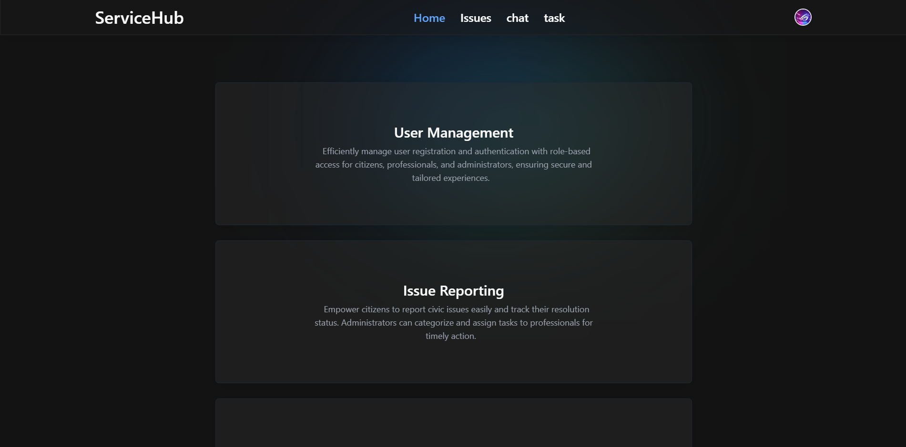
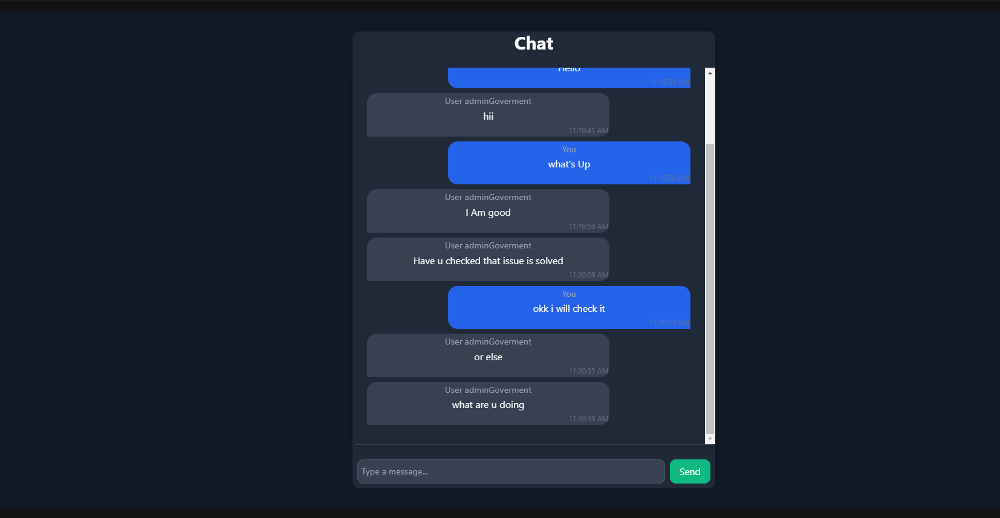
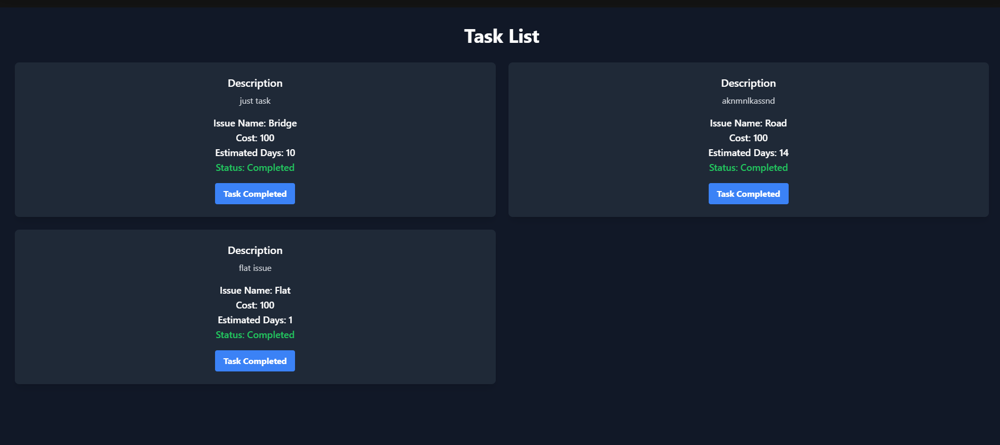

# Citizen-Government Professional Interaction Platform (CGPIP)

## Overview

The **Citizen-Government Professional Interaction Platform (CGPIP)** is a centralized, web-based system designed to enhance communication and task management between citizens, government authorities, and certified professionals. The platform streamlines the process of reporting civic issues and ensures their resolution through a transparent and accountable workflow.

## Key Features

- **Issue Reporting**: Citizens can report civic issues (e.g., infrastructure problems, service needs) using a user-friendly interface that supports multimedia submissions, including images and videos.
  
- **Task Assignment**: Government administrators can assign reported issues as tasks to certified professionals such as electricians, plumbers, and other service providers.
  
- **Proposal Submission**: Certified professionals can submit proposals for resolving issues assigned to them.

- **Integration with Government Databases**: Secure integration with existing government databases and authentication services ensures reliable and accurate information exchange.

## Technology Stack

- **Frontend**: React
- **Backend**: Node.js/Express
- **Database**: MongoDB
- **Multimedia Handling**: Cloudinary
- **Security**: Adheres to strict data security standards and best practices

## Objectives

- **Transparency and Accountability**: Ensures an open workflow between citizens, authorities, and professionals.
- **Efficient Service Delivery**: Streamlines the resolution of civic issues, benefiting citizens with faster solutions.
- **Scalability**: Designed for future expansion to support additional features and services.

## Installation

1. Clone the repository:
   ```bash
   git clone https://github.com/yourusername/CGPIP.git




